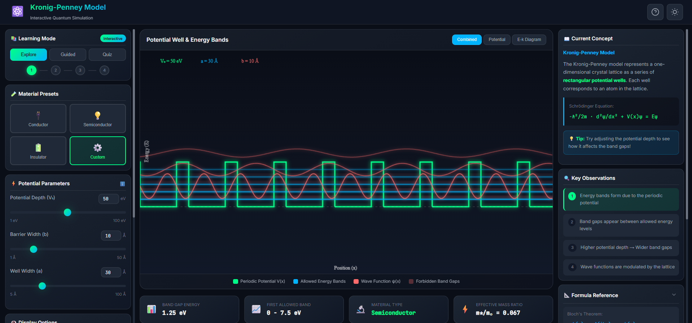
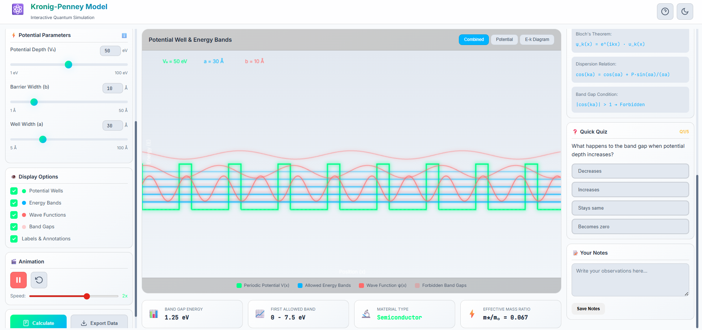

### 1. Getting Started
*   Open the simulation page.
*   You will see the **Control Panel** on the left, the **Visualization Canvas** in the center, and the **Info Panel** on the right.
*   By default, the "Explore" mode is active.

### 2. Exploring Material Presets
*   Go to the **Material Presets** section in the left panel.
*   Click on **Conductor**: Observe how the energy bands are wide and may overlap. The band gap is virtually non-existent.
*   Click on **Semiconductor**: Notice the appearance of distinct band gaps between the allowed energy bands.
*   Click on **Insulator**: Observe the very wide band gaps that form, preventing electron flow.

### 3. Custom Experimentation
*   Select the **Custom** preset.
*   **Vary Potential Depth (V0):** Use the slider to increase V0. Watch how the band gaps widen as the potential barrier increases.
*   **Vary Well Width (<i>a</i>):** Adjust the well width and observe changes in the wave functions and energy levels.

### 4. Guided Learning
*   Click on the **Guided** tab in the "Learning Mode" section.
*   Follow the on-screen prompts (toasts) and step indicators to systematically explore the model.

### 5. Visualization Options
*   Use the **Display Options** checkboxes to toggle:
    *   **Potential Wells** (Green lines)
    *   **Energy Bands** (Blue lines)
    *   **Wave Functions** (Red curves)
    *   **Band Gaps** (Red shaded regions)
*   Switch views using the buttons above the canvas:
    *   **Combined:** Shows everything.
    *   **Potential:** Focuses on the lattice structure.
    *   **E-k Diagram:** Shows the dispersion relation.

## Simulation Screenshots

Below are the screenshots from the Kronig-Penney model simulation:

**Figure 1:** Main simulation interface showing the control panel, visualization canvas, and info panel.

**Figure 2:** Energy band structure and wave functions for different material types.

## Observation Table

Record your observations for different potential depths and widths below:

<table>
    <thead>
        <tr style="background: linear-gradient(135deg, #667eea, #764ba2); color: white;">
            <th style="padding: 12px; border: 1px solid #ddd;">S.No.</th>
            <th style="padding: 12px; border: 1px solid #ddd;">Potential Depth (V0) (eV)</th>
            <th style="padding: 12px; border: 1px solid #ddd;">Well Width (<i>a</i>) (Å)</th>
            <th style="padding: 12px; border: 1px solid #ddd;">Observed Band Gap (eV)</th>
            <th style="padding: 12px; border: 1px solid #ddd;">Material Type</th>
        </tr>
    </thead>
    <tbody>
        <tr>
            <td style="padding: 8px; border: 1px solid #ddd; text-align: center;">1</td>
            <td style="padding: 8px; border: 1px solid #ddd;">5</td>
            <td style="padding: 8px; border: 1px solid #ddd;">30</td>
            <td style="padding: 8px; border: 1px solid #ddd;">~0.1</td>
            <td style="padding: 8px; border: 1px solid #ddd;">Conductor</td>
        </tr>
        <tr>
            <td style="padding: 8px; border: 1px solid #ddd; text-align: center;">2</td>
            <td style="padding: 8px; border: 1px solid #ddd;">15</td>
            <td style="padding: 8px; border: 1px solid #ddd;">30</td>
            <td style="padding: 8px; border: 1px solid #ddd;">~1.1</td>
            <td style="padding: 8px; border: 1px solid #ddd;">Semiconductor</td>
        </tr>
        <tr>
            <td style="padding: 8px; border: 1px solid #ddd; text-align: center;">3</td>
            <td style="padding: 8px; border: 1px solid #ddd;">80</td>
            <td style="padding: 8px; border: 1px solid #ddd;">30</td>
            <td style="padding: 8px; border: 1px solid #ddd;">~5.5</td>
            <td style="padding: 8px; border: 1px solid #ddd;">Insulator</td>
        </tr>
        <tr>
            <td style="padding: 8px; border: 1px solid #ddd; text-align: center;">4</td>
            <td style="padding: 8px; border: 1px solid #ddd;">50</td>
            <td style="padding: 8px; border: 1px solid #ddd;">20</td>
            <td style="padding: 8px; border: 1px solid #ddd;">~3.2</td>
            <td style="padding: 8px; border: 1px solid #ddd;">Insulator</td>
        </tr>
        <tr>
            <td style="padding: 8px; border: 1px solid #ddd; text-align: center;">5</td>
            <td style="padding: 8px; border: 1px solid #ddd;">20</td>
            <td style="padding: 8px; border: 1px solid #ddd;">40</td>
            <td style="padding: 8px; border: 1px solid #ddd;">~1.5</td>
            <td style="padding: 8px; border: 1px solid #ddd;">Semiconductor</td>
        </tr>
    </tbody>
</table>

### 6. Quiz and Analysis
*   Switch to **Quiz** mode to test your understanding.
*   Use the **Calculate** button to verify the band gap values.
*   Save your findings in the **Notes** section.
