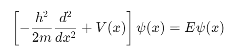
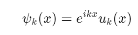
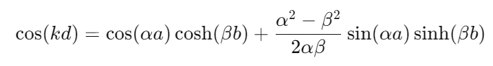

The Kronig-Penney model is a fundamental concept in solid-state physics that provides insight into the electronic structure of crystalline solids. It simplifies the complex interactions of electrons in a periodic potential, making it easier to understand how energy bands form in materials. The model uses a one-dimensional periodic potential to represent the lattice of a crystal, which leads to the formation of energy bands and band gaps—key concepts that explain the electrical properties of materials, such as conductors, semiconductors, and insulators. 
The aim of this experiment is to explore the Kronig-Penney model by simulating the behavior of electrons in a periodic potential. Through this simulation, participants will visualize how energy bands and band gaps form, understand the relationship between the periodic potential and electronic structure, and investigate the impact of varying potential parameters on electron wavefunctions and energy levels. 
## The Kronig-Penney Model 
The Kronig-Penney model represents a one-dimensional crystal lattice as a series of rectangular potential wells, with each well corresponding to an atom in the lattice. The potential is periodic, meaning it repeats itself at regular intervals. 
## Energy Bands and Gaps 
When electrons move through this periodic potential, they are allowed to occupy specific energy levels known as energy bands. Between these bands are forbidden regions called band gaps, where no electron states exist. 
## Key Equations: 
1. ### Schrödinger's Equation: 
Where ℏ is the reduced Planck constant, mmm is the electron mass, V(x) is the potential energy, ψ(x) is the wavefunction, and E is the energy. 
 
2.	### Bloch's Theorem: 
This theorem states that the wavefunction ψk(x) in a periodic potential can be written as a plane wave multiplied by a periodic function. 
 
3. ### Dispersion Relation(for a simplified Kronig-Penney model): 
Where k is the wavevector, d is the period of the potential, α and β are constants related to the potential height and the energy of the electron 
 
Implications: 
•	Conductors have overlapping energy bands, allowing electrons to move freely. 
•	Insulators have wide band gaps, preventing electron flow. 
•	Semiconductors have narrow band gaps, which can be crossed by thermal or optical excitation 

